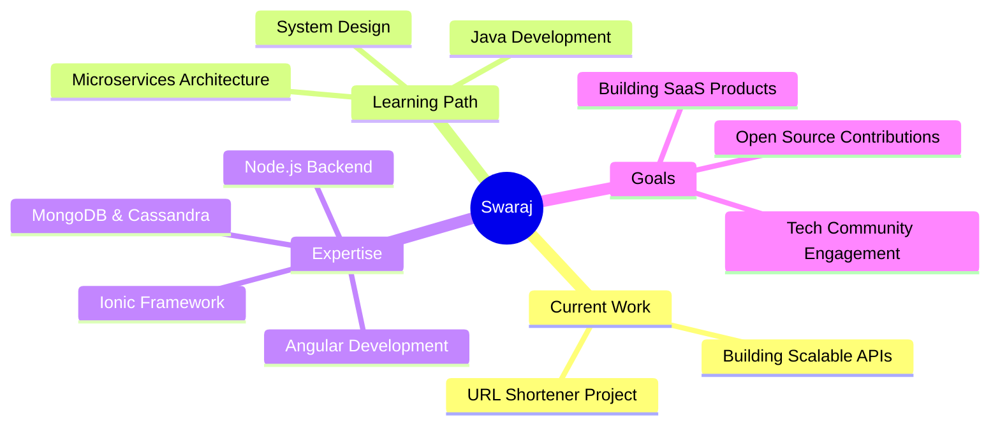

<div align="center">
  
</div>

<div align="center">
  
  ### 👨‍💻 Full Stack Developer | 🚀 Building Scalable Web Applications
  
  
  
</div>

---

### 💫 About Me

```javascript
const swaraj = {
    currentProject: "URL Shortener 🔗",
    learning: ["Java ☕", "System Design 🏗️", "Microservices 🔧"],
    expertise: ["Angular", "Ionic", "Node.js", "Express", "NestJS"],
    askMeAbout: ["Web Development", "API Design", "Angular", "Ionic"],
    funFact: "I love exploring new technologies and building scalable apps! 🚀",
    lookingFor: "Exciting collaboration opportunities"
};
```

---

### 🌐 Connect With Me

<div align="center">
  
[](https://linkedin.com/in/swaraj-kumar5)
[](https://x.com/Swaraj_7x)
[](https://github.com/Swaraj55)
[](mailto:your.email@example.com)

</div>

---

### 💻 Tech Stack

<div align="center">

#### Frontend Technologies


#### Frameworks & Libraries


#### Backend Technologies


#### Databases


#### DevOps & Tools


</div>

---

### 📊 GitHub Statistics

<div align="center">
  
  
</div>

<div align="center">
  
</div>

---

### 🏆 GitHub Trophies

<div align="center">
  
</div>

---

### 📈 Contribution Activity

<div align="center">
  
</div>

---

### 📊 Detailed GitHub Metrics

<div align="center">
  
</div>

<div align="center">
  
  
  
</div>

---

### 🎯 Current Focus

<div align="center">
  


</div>

---

### 💡 Random Dev Quote

<div align="center">
  


</div>

---

### 🎵 Now Playing

<div align="center">
  
[](https://github.com/kittinan/spotify-github-profile)

</div>

---

<div align="center">
  
### 💖 Support My Work

If you like my projects, consider buying me a coffee! ☕

[](https://buymeacoffee.com/swaraj)

</div>

---

<div align="center">
  


### ⭐️ From [Swaraj55](https://github.com/Swaraj55) with 💙


</div>

<!-- Proudly created with GPRM ( https://gprm.itsvg.in ) -->
